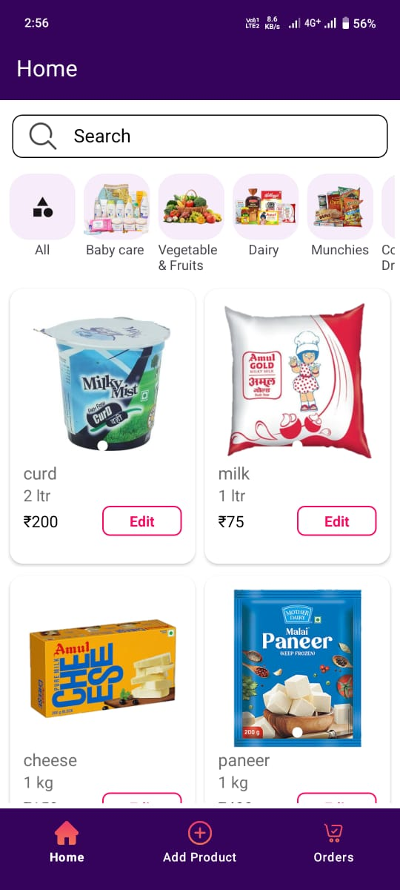
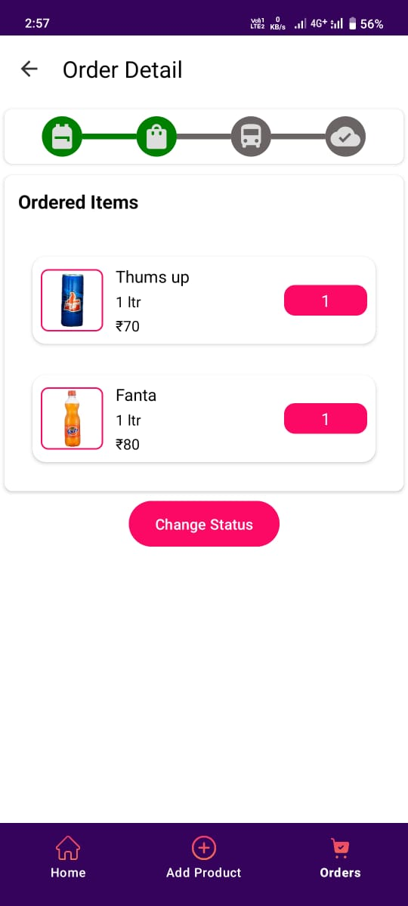

# 🏪 Doorstep Admin App

<p align="center">
  
</p>

<p align="center">
  <b>Doorstep Admin</b> is a powerful Android application designed for store administrators to efficiently manage products, inventory, and customer orders. Built with modern Android development practices and powered by Supabase, the application provides real-time product management, order tracking, inventory control, and image storage capabilities.
</p>

<p align="center">
  
  
  
  
  
</p>

---

# 🛒 Doorstep Ecosystem

Doorstep consists of two separate Android applications:

| Application           | Description                                          |
| --------------------- | ---------------------------------------------------- |
| 📱 Doorstep User App  | Customer-facing grocery shopping application         |
| 🏪 Doorstep Admin App | Product, inventory, and order management application |

### Related Repositories

* 📱 User App Repository: https://github.com/Rishicharhate/Doorstep-user-app
* 🏪 Admin App Repository: https://github.com/Rishicharhate/Doorstep-Admin-App

---

# 📱 Application Screenshots

## Authentication

| Login                                         |
| --------------------------------------------- |
|  |

## Product Management

| Dashboard                                         | Add Product                                         | Edit Product                                         |
| ------------------------------------------------- | --------------------------------------------------- | ---------------------------------------------------- |
|  |  |  |

## Inventory Management

| Category Filter                                    | Search Products                                |
| -------------------------------------------------- | ---------------------------------------------- |
|  |  |

## Order Management

| Orders                                         | Order Details                                         | Update Status                                        |
| ---------------------------------------------- | ----------------------------------------------------- | ---------------------------------------------------- |
|  |  |  |

---

# ✨ Features

## 📦 Product Management

### Add Products

* Create new products instantly.
* Add:

  * Product Title
  * Category
  * Price
  * Quantity
  * Unit
  * Available Stock
  * Product Type

### Multi-Image Upload

* Select multiple product images.
* Upload directly to Supabase Storage.
* Automatic image URL generation.
* Product image slideshow support.

### Edit Products

* Update product information in real-time.
* User-friendly BottomSheet editing interface.
* Instant database synchronization.

### Smart Search

Search products by:

* Product Title
* Category
* Price
* Product Type

### Category Filtering

* Dynamic horizontal category list.
* Fast category-based product filtering.

---

## 📋 Order Management

### Order Tracking

* View all customer orders.
* Order creation date.
* Order amount.
* Delivery address.
* Customer details.

### Detailed Order View

View:

* Ordered Products
* Product Images
* Product Quantities
* Individual Product Prices
* Total Amount

### Order Status Updates

Update order progress through:

* 📦 Packed
* 🚚 Shipped
* ✅ Delivered

Changes are synchronized instantly with the User App.

---

## 🔐 Authentication

* Email OTP Authentication.
* Secure Supabase Auth integration.
* Persistent admin sessions.
* Protected access to management features.

---

## ☁️ Supabase Integration

### PostgreSQL Database

* Product Management
* Orders
* Order Items
* Customer Profiles

### Supabase Storage

* Product Images
* Multi-image Uploads
* Secure File Hosting

### Supabase Auth

* Email Authentication
* Session Management
* Secure Login

---

# 🏗 Architecture

The application follows modern Android development practices.

```text
Presentation Layer
│
├── Activities
├── Fragments
├── RecyclerView Adapters
└── ViewBinding

Business Layer
│
├── ViewModels
├── Repositories
└── Data Processing

Data Layer
│
├── Supabase Database
├── Supabase Storage
├── Supabase Auth
└── Models
```

---

# 🛠 Tech Stack

| Category          | Technology           |
| ----------------- | -------------------- |
| Language          | Kotlin               |
| Architecture      | MVVM                 |
| UI                | XML Layouts          |
| View Binding      | ViewBinding          |
| Backend           | Supabase             |
| Database          | PostgreSQL           |
| Storage           | Supabase Storage     |
| Authentication    | Supabase Auth        |
| Image Loading     | Glide                |
| Navigation        | Navigation Component |
| Async Programming | Kotlin Coroutines    |
| Loading Effects   | Facebook Shimmer     |
| Product Gallery   | ImageSlider          |

---

# ⚙️ Supabase Setup

## 1️⃣ Create Supabase Project

Create a project from:

https://supabase.com

Retrieve:

* Project URL
* Public API Key

---

## 2️⃣ Create Database Tables

Create the following tables:

### Products Table

```text
admin
```

### Orders Table

```text
orders
```

### Order Items Table

```text
order_items
```

### User Profiles Table

```text
profiles
```

---

## 3️⃣ Create Storage Bucket

Create a public storage bucket:

```text
product-images
```

This bucket stores all product images uploaded by administrators.

---

## 4️⃣ Configure Supabase Client

Open:

```text
SupabaseClient.kt
```

Replace:

```kotlin
val client = createSupabaseClient(
    supabaseUrl = "YOUR_SUPABASE_URL",
    supabaseKey = "YOUR_SUPABASE_ANON_KEY"
) {
    install(Auth)
    install(Postgrest)
    install(Storage)
}
```

---

# 🚀 Getting Started

## Clone Repository

```bash
git clone https://github.com/Rishicharhate/Doorstep-Admin-App.git
```

## Open Project

Open with:

```text
Android Studio Hedgehog or newer
```

## Configure Backend

* Create Supabase Project
* Configure Database Tables
* Create Storage Bucket
* Add API Keys

## Run Application

```bash
Shift + F10
```

or click the Run button in Android Studio.

---

# 📁 Project Structure

```text
app/
│
├── activity/
│   └── UserMainActivity
│
├── fragments/
│   ├── HomeFragment
│   ├── AddProductFragment
│   ├── OrdersFragment
│   └── OrderDetailsFragment
│
├── adapter/
│
├── models/
│
├── utils/
│
├── viewmodels/
│
└── SupabaseClient.kt
```

---

# 🔄 Integration With User App

The Admin App works alongside the Doorstep User App.

### Real-Time Sync Features

* New Products instantly appear in User App.
* Product updates reflect automatically.
* Order status changes are visible to customers.
* Shared Supabase backend ensures synchronized data.

---

# 🔮 Future Enhancements

* Dashboard Analytics
* Sales Reports
* Revenue Tracking
* Inventory Alerts
* Push Notifications
* Product Approval Workflow
* Multi-Admin Support
* Role-Based Access Control

---

# 👨‍💻 Developer

### Rishi Charhate

Android Developer • AI/ML Enthusiast • Full Stack Learner

---

# ⭐ Support

If you found this project useful, please give it a ⭐ on GitHub.

Your support helps improve the project and encourages future development.

---

## License

This project is licensed under the MIT License.
